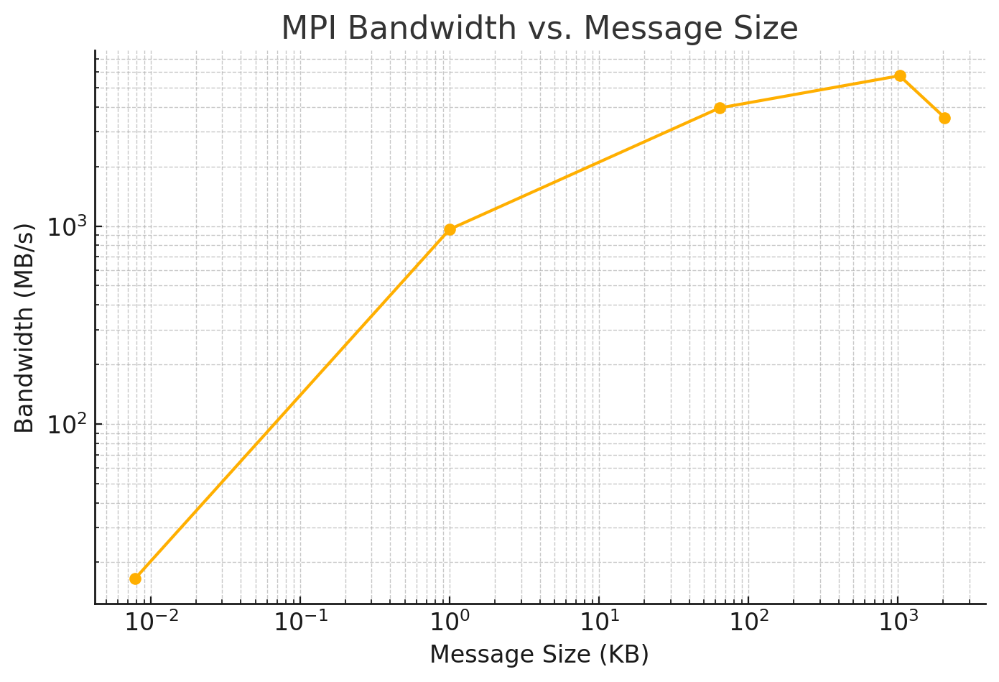

# Week 4: MPI Communications - High Performance Computing

## Overview
This week focused on **MPI communications**, covering:
- **Point-to-point communication** (`MPI_Send`, `MPI_Ssend`, `MPI_Bsend`, `MPI_Rsend`, `MPI_Isend`).
- **Measuring latency and bandwidth** with a **Ping-Pong** benchmark.
- **Collective communications** (`MPI_Bcast`, `MPI_Scatter`, `MPI_Gather`, `MPI_Reduce`).
- **Optimizing data distribution and summation** in parallel computations.

---

## Part 1: MPI Point-to-Point Communications

### Objective
- Implement an **MPI "Hello World"** program to understand basic message passing.
- Test **different send types** and analyze performance.

### Send Type Performance Summary

| Send Type  | Observations                                   |
|------------|-----------------------------------------------|
| `MPI_Send` | Default send, reliable and balanced.          |
| `MPI_Ssend`| Slightly slower due to synchronization.       |
| `MPI_Bsend`| Required buffer setup; inconsistent speed.    |
| `MPI_Rsend`| Fails if the receiver is not ready.           |
| `MPI_Isend`| Non-blocking, requires `MPI_Wait()` to complete. |

---

## Part 2: MPI Ping-Pong Benchmarking (Latency & Bandwidth)

### Objective
- Measure **latency (time per message)** and **bandwidth (data per second)**.
- Use `MPI_Wtime()` to track execution time.

### Latency Results
Ping-Pong latency over 10000 pings: Total Time = 0.008873037 seconds Avg Time per send/recv = 4.436518500e-07 seconds (0.44365 µs)

- Low latency (~0.44 µs per message).
- Overhead affects small messages more significantly.

### Bandwidth Results

| Data Size | Total Time (s) | Bandwidth (MB/s) |
|-----------|----------------|------------------|
| 8B        | 0.000987       | 16.2 MB/s        |
| 1KB       | 0.002125       | 963.7 MB/s       |
| 64KB      | 0.033159       | 3952.8 MB/s      |
| 1MB       | 0.364746       | 5749.6 MB/s      |
| 2MB       | 1.186352       | 3535.4 MB/s      |

- Bandwidth peaks around 1MB message size (~5.7 GB/s).
- Large messages slow down due to buffer and memory constraints.

### Plot: MPI Bandwidth vs. Message Size

---

## Part 3: MPI Collective Communications

### Objective
- Compare **manual summation** vs. **`MPI_Gather` vs. `MPI_Reduce`**.
- Verify performance on a **vector sum** problem.

### Final Results
Final sum using MPI_Gather: 5000050000 Final sum using MPI_Reduce: 5000050000 MPI_Gather Time: 0.000020 seconds MPI_Reduce Time: 0.000007 seconds

- `MPI_Reduce` is more efficient than `MPI_Gather` for summation.
- `MPI_Gather` collects all data at Rank 0, whereas `MPI_Reduce` performs the sum in parallel.
- Integer overflow was avoided by using `long long int`.

---

## Conclusion and Key Learnings
- Point-to-point communication methods vary in reliability and efficiency.
- Latency and bandwidth testing shows optimal message sizes (~1MB) for high performance.
- `MPI_Reduce` is faster than `MPI_Gather` for distributed summation.
- Using correct data types (such as `long long int`) prevents overflow in large sums.

